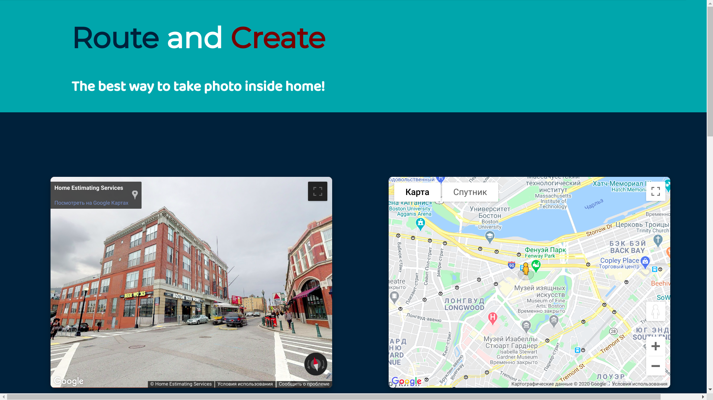
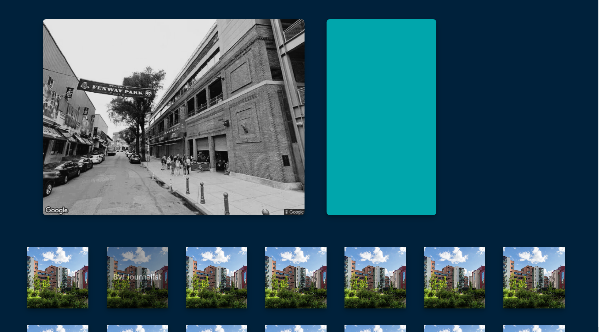

# Route and Create
*Веб-приложение, позволяющее делать фото по всему миру _через интернет_*

## Cодержание
1. [Как использовать](#как-иcпользовать)
2. [Запуск сервера](#запуск-сервера)
3. [Скриншоты](#cкриншоты)
4. [Техническая сторона](#техническая-сторона)
5. [Тесты](#тесты)


## Как иcпользовать
* Перемещайтесь по миру используя интерактивные Street View и Maps (они синхронизированы)
    * Используйте pegman'a (человечка) для перемещения с помощью Maps! 
* Делайте фото по нажатию `Capture`
* Накладывайте фильтры (работающие по технологии 3D LUT) с помошью иконок фильтров снизу
* Скачивайте фото по нажатию `Download`
* Удаляйте фото по нажатию `Delete`

## Запуск сервера
1. Необходимые модули: os, **flask**
2. Размер проекта при скачивании ~39MiB, на диске: ~119MiB - это нормально (Такой большой размер связан с пресетами) 
    ```shell script
    git clone https://github.com/vanka857/Route-Create.git
    cd Route-Create
    python3 app.py
    ```
3. Сайт будет доступен по адресу http://127.0.0.1:5000/

## Cкриншоты
#### _Travel all over the world_

#### _Create picture and edit it_


## Техническая сторона
написано на **Python** + **flask**

использованное API:
1. [jQuery API](https://api.jquery.com/) (работа с ajax запросами)
2. [Google Maps JavaScript API](https://developers.google.com/maps/documentation/javascript/) (интерактивная карта)
3. [Google Street View JavaScript API](https://developers.google.com/maps/documentation/streetview/) (интерактивный модуль StreetView)
4. [Google Maps Static API](https://developers.google.com/maps/documentation/maps-static/) (получение изображений)

API Google Maps, Street View используется `по моему личному ключу` (API Key), настроенному в целях безопасности для работы тоько по адресу http://127.0.0.1:5000/ 
   
## Тесты
Использован модуль для тестирования **pytest**

Тесты написаны в файле [test_app.py](test_app.py)

#### Запуск тестов:
1. Необходимые модули: os, **pytest**
2. Сначала скачайте проект и перейдите в папку с проектом (шаг 1, 2 в [запуск сервера](#server_starting)). Затем выполните:
    ```shell script
    pytest -v
    ```
